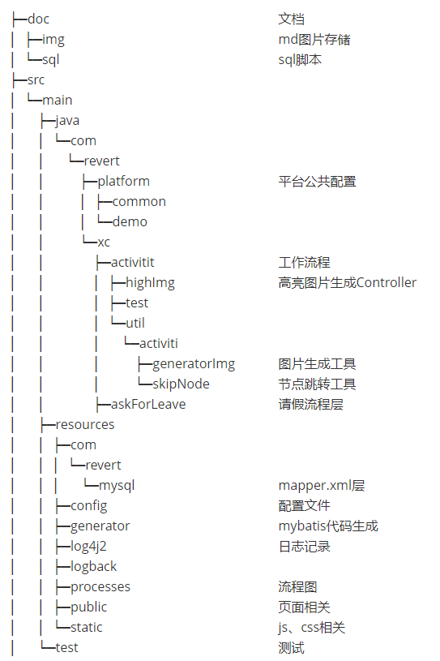

## Activiti6

### xiecong

### 效果：

### sql位置：

​	[sql](./doc/sql)

### 包含功能：

​	1、springboot整合Activiti6

​	2、简单流程demo

​	3、流程跟踪图生成

​	4、节点跳转(目前有问题，节点跳转之后 在用流程跟踪图看一下就有问题部分线没有连起来)

### 目录结构：

├─doc									文档
│  ├─img								md图片存储
│  └─sql									sql脚本
├─src
│  └─main
│      ├─java
│      │  └─com
│      │      └─revert
│      │          ├─platform					平台公共配置
│      │          │  ├─common
│      │          │  └─demo
│      │          └─xc
│      │              ├─activitit					工作流程
│      │              │  ├─highImg				高亮图片生成Controller
│      │              │  ├─test
│      │              │  └─util					
│      │              │      └─activiti
│      │              │          ├─generatorImg		图片生成工具
│      │              │          └─skipNode			节点跳转工具
│      │              ├─askForLeave				请假流程层
│      ├─resources
│      │  ├─com
│      │  │  └─revert
│      │  │      └─mysql						mapper.xml层
│      │  ├─config							配置文件
│      │  ├─generator						mybatis代码生成
│      │  ├─log4j2							日志记录
│      │  ├─logback
│      │  ├─processes						流程图
│      │  ├─public							页面相关
│      │  └─static							js、css相关
│      └─test								测试

